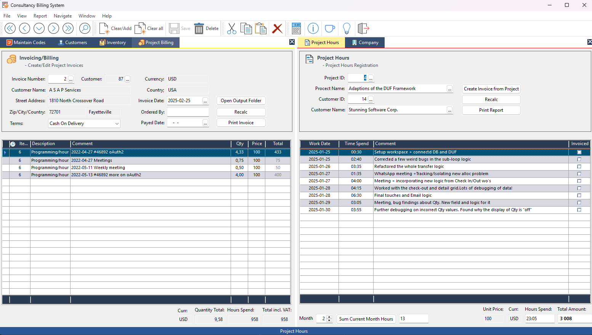

## Project Billing for consultants

This tool is designed for programmers who run their own businesses. It simplifies the process of tracking project progress and time spent on tasks. One of its most helpful features is the ability to automatically generate an invoice based on a project, which can then be printed as a PDF file for easy emailing to customers.
## Example

Below is a sample image showcasing the `ProjectBilling.src` program:

!(Bitmaps/TestTools.bmp)
