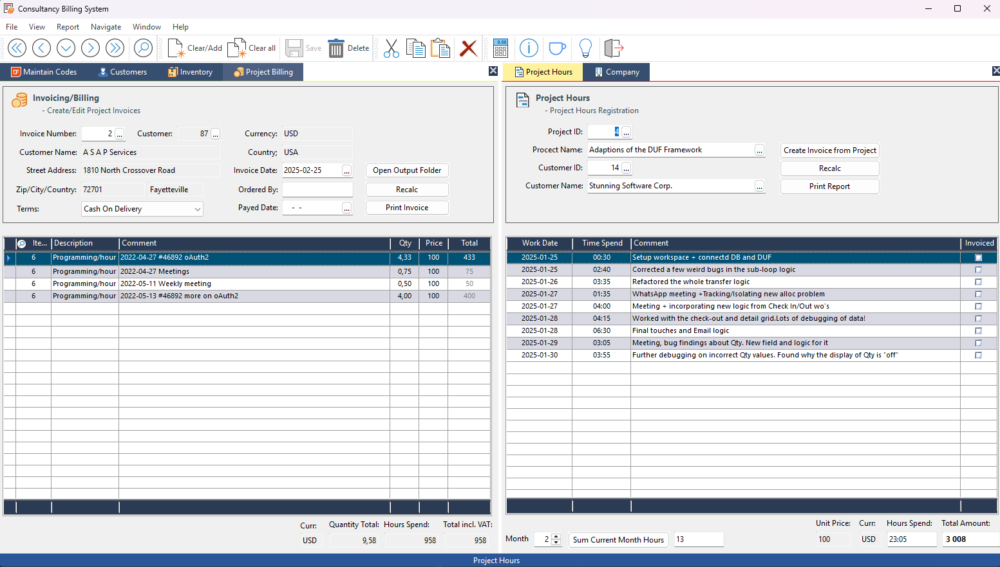

## Project Billing for consultants

This tool is designed for programmers who run their own businesses. It simplifies the process of tracking project progress and time spent on tasks. One of its most helpful features is the ability to automatically generate an invoice based on a project, which can then be printed as a PDF file for easy emailing to customers.
## Example

Below is a sample image showcasing the `ProjectBilling.src` program:

## Setup after cloning

After cloning this repository, run **`setup.bat`** once from the repository root. It:

- downloads / updates the library submodules under `Libraries\` (DFAbout, DigitalCert, DUF, RDCToolsLib, vwin32fh) to the versions this workspace expects;
- configures this clone so a normal `git pull` keeps those libraries in sync automatically from then on.

Re-run `setup.bat` any time the `Libraries\` folders look empty or out of date, or when a new submodule is added.
