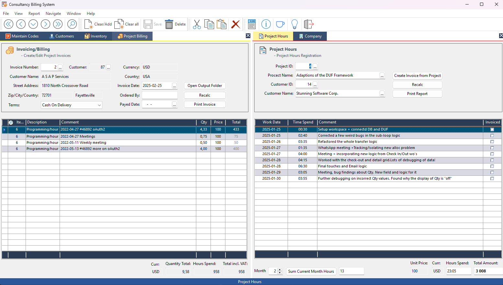

## Project Billing for consultants

This tool is designed for programmers who run their own businesses. It simplifies the process of tracking project progress and time spent on tasks. One of its most helpful features is the ability to automatically generate an invoice based on a project, which can then be printed as a PDF file for easy emailing to customers.
## Example

Below is a sample image showcasing the `ProjectBilling.src` program:

## Setup after cloning

The libraries this workspace uses (DFAbout, DigitalCert, DUF, RDCToolsLib, vwin32fh) are **not**
stored in this repository (they are gitignored). Run **`setup.bat`** once from the repository root
and it provides them, behaving differently by machine so one arrangement serves both maintainer and
user:

- On a machine with the shared RDC library pool next door (a sibling `..\Libraries` carrying the
  marker file `.rdc-library-pool`), it makes `Libraries\` a **junction** to that pool — one shared,
  editable copy of every library.
- Otherwise it **clones** the five libraries into this workspace's own `Libraries\` folder:
  isolated, self-contained, and it never writes anywhere outside this workspace. (DUF comes from
  the current `Library-DUF` repo; the old `DbUpdateFramework` repo is superseded by it.)

It also runs `skip-local-data.cmd` so your local `Data\` database changes stay on your machine.
Either way `Libraries\` is local-only and never committed — re-run `setup.bat` any time it looks
missing or out of date. (Because `Libraries\` may be a junction, do not run `git clean -x` here.)
